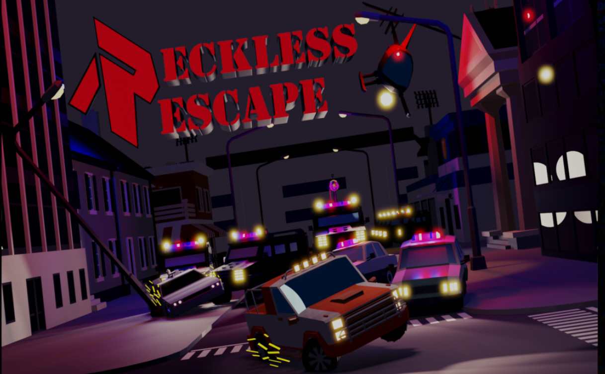

# Reckless Escape

## Welcome! 👋

Thanks for checking out "Reckless Escape". The game's core mechanics involve efficiently collecting loot scattered across the game world within a time constraint, all while contending with relentless pursuits by police cars. Unity 3D serves as the primary development engine, enabling the implementation of intricate gameplay elements and the orchestration of the overall gaming experience.

## Trailer

### Built with:
- Unity
- Blender 3D
